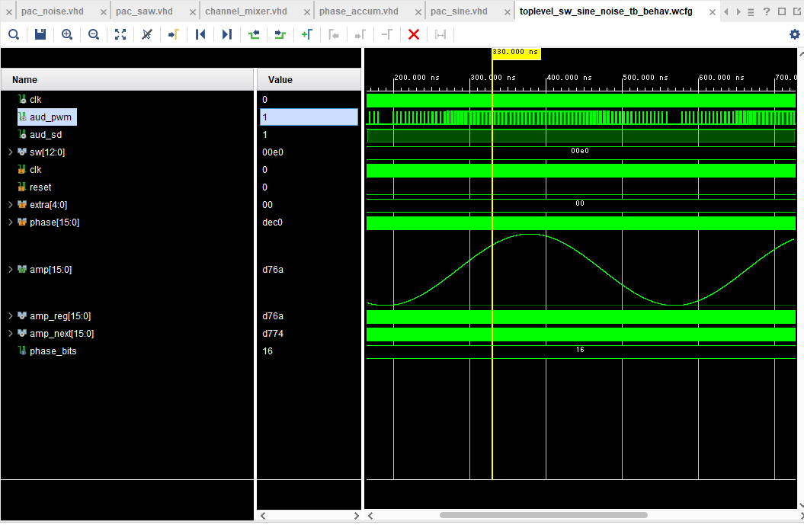

# Projects I Did During College

I don't usually use GitHub for any of my personal projects and since I've been handing out resumes recently I thought it would be prudent to make a repo to show them off.

## Table of Contents
- [FPGA Synth](#fpga-synth-in-vhdl)
- [Cellular Automata Terrain Gen](#python-cellular-automata-terrain-generation)
- [Fixed-Point Library](#fixed-point-library-in-c++)
- [ASCII Drawing Program in JavaScript](#ascii-drawing-program-in-javascript)
- [Machine Learning Experiments in Pytorch](#various-machine-learning-experiments-in-pytorch)

## FPGA Synth in VHDL

This was a final project for a class in spring of 2025. One of hte suggested projects was a "waveform generator", which made me want to create a full-fledged sequencer. I never finished the sequencing aspect or made a demo song to play off it, but the resulting project is a functional (albeit not very user-friendly) monophonic synthesizer on an FPGA. For all MIDI frequencies it can output:
- Square waves (with pulse width modulation)
- Sawtooth waves (with incorrectly done pulse-width modulation)
- Triangle waves
- Sine waves
- Noise (which can change pitch, or can be more "metallic" and harsh sounding like the option on the NES noise channel)

Here's a (very low quality) video demonstrating it:

<video src="https://github.com/user-attachments/assets/80758e3f-b586-4172-b190-afab6e921376"></video>

A high-level diagram of the design:


And a simulation in Vivado showing an output sine wave (and corresponding PWM output to the DAC a few rows above it):


## Python Cellular Automata Terrain Generation

This project was done around my freshman year and was supposed to be a part of an AI club project which I got immensely side-tracked on. The original project was to create some simple agents that would live and evolve in a 2D tile world. The process of trying to come up with ways to do terrain generation became extremely engrossing and, with my less-than-ideal organizational abilities at the time, the project went off the rails and I ended up making a scripting language to go with it. Unfortunately, I wasn't using any version control at the time and was in the middle of completely refactoring the code when I stopped working on it, so the code is both bad (poorly written and unoptimized) and broken. Still, I always enjoy looking back at this project because the results left over are pretty cool.

Here's an example input script file:
<details>
  <summary>Script</summary>
  
  ```
  size 200 100
  noisemap 10
  do steps 20 rad 7 offset d rand
  save
  clear
  noisemap 1.5
  do steps 5 rad 4 offset d c b 1 2 3 s a
  compo add
  save
  clear
  sinenoisemap add 10 amp rand period rand
  sinenoisemap subtract 20 amp rand period rand
  sinenoisemap add 10 amp rand period rand
  sinenoisemap subtract 20 amp rand period rand
  compo posintersect
  save
  clear
  sinenoisemap add 40 amp rand period rand
  sinenoisemap subtract 10 amp rand period rand
  sinenoisemap add 8 amp rand period rand
  sinenoisemap subtract 12 amp rand period rand
  compo posintersect
  save
  clear
  noisemap 6
  do steps 10 rad 4000 offset d c b 3 4 s a
  do steps 1 rad 1000000 offset d c b 8 s 2 3 4 5 6 7 8
  save e
  clear
  noisemap 6
  do steps 5 rad 4000 offset d c b 3 4 s a
  do steps 1 rad 1000000 offset d c b 8 s 2 3 4 5 6 7 8
  compo add e
  save e
  clear
  noisemap 6
  do steps 2 rad 4000 offset d c b 3 4 s a
  do steps 1 rad 1000000 offset d c b 8 s 2 3 4 5 6 7 8
  compo add e
  compo add
  ```
</details>

And the example output file showing the terrain:


The program also generated process gifs which showed each rule in action as the image was being created.
You can see the process for the above image below. (WARNING: QUICKLY FLASHING COLORS)
<details>
  <summary>Gif</summary>

  
</details>

More scripts and example outputs can be found in the `Python_Cellular_Automata_Rockgen` folder.

## Fixed-Point Library in C++

This actually isn't all that special, it's a pretty standard implementation of fixed-point numbers (some of it copied from other libraries and changed slightly). This is mainly an artifact of an ongoing (and repeatedly restarting) 2D game I've been making with SDL, but everything else about the game has been scrapped or is in too half-finished of a state to show.

It also isn't super optimized because operator overloading in C++ isn't free; at some point I'll have to bite the bullet and implement expression templates (basically creating another AST using templates so that operator overloading can actually be optimized correctly). 

A nice little demo I made with it to test the numerical stability of oscillators of different fixed point sizes (vs floats and doubles) can be seen in the video below. The fixed-point types are denoted "fixed \<total bits\> : \<bits in fraction\>" 

<video src="https://github.com/user-attachments/assets/45ebda34-4057-4859-b8b6-1b0b36c46b8c"></video>

## ASCII Drawing Program in JavaScript

I never finished this one, but it's at a stage where I can reasonably show off a little of it. I was originally wanting to make a roguelike for browser, but then I thought about the possibility of creating your own maps with a tool, so I created a paint program that works with colored text. If I ever returned to working on this, I'd stop using 10,000 DOM nodes and switch to using the HTML5 canvas instead, since it runs pretty poorly. Some tools are broken or completely unimplemented.

The documentation for the program is linked on my WIP website GitHub page [here](https://jakbern.github.io/website_stuff/). A direct link to the program is [here](https://jakbern.github.io/website_stuff/map_viewer.html). The line, fill, circle, rect, and curve tools work at the very least.

## Various Machine Learning Experiments in Pytorch

I didn't upload these because I feel embarrassed by how naive the models were and how I don't have much to show for them. I will describe the projects briefly:

### 1. Finger Tracker

I wanted to create a demo project for the AI club at KU which could be brought to a middle school, so I tried making a model that tracks only index fingers. I also wanted it to run in the browser, and since I use Firefox I had to use the web onnx runtime since it used WebGL and Firefox didn't have WebGPU support.

The architecture was based on the ConvNeXt paper, but I had to remove layernorm and GeLU since neither operations were supported. There were a lot of hoops I was jumping through (converting the model to base64 and loading it in as a JS file so I could deploy the application without running a server) while trying to train on too little data and with an ill-defined objective.

Still, I learned a lot.

### 2. Instrument Cloner

I'm interested in sound synthesis and wanted to try an create an artificial piano sound using an MLP that took as input:
- the fundamental frequency of a note
- various other parameters I tried out (length of audio, average volume, peak volume, sometimes none of these).
and would output:
- a series of coefficients for the frequencies and phases of 16 - 32 sine waves
- coefficients for volume envelopes that would be applied to these sine waves (note: a normal ADSR envelope is just a piecewise function and not differentiable wrt where the envelope starts/ends. I instead used opening/closing sigmoids which could be parameterizd to act like an envelope)

I tried training using reconstruction loss (on the raw audio output) and multi-scale spectral loss (used in the DDSP paper). I still haven't given up on the idea that this might work, but I think I have insufficient/too poorly labeled data and some aspects of the idea may need tweaking.
